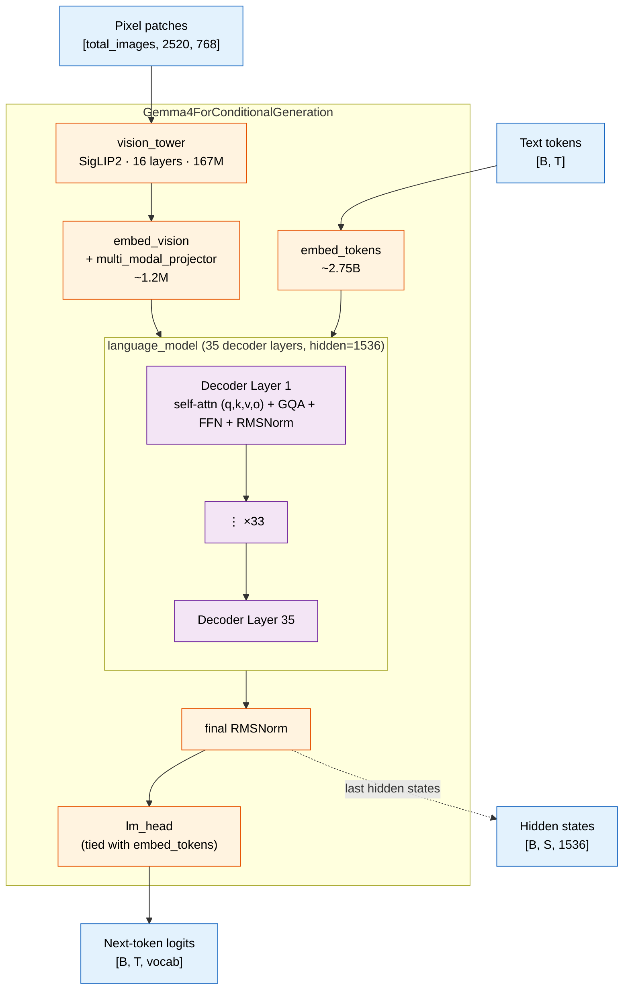
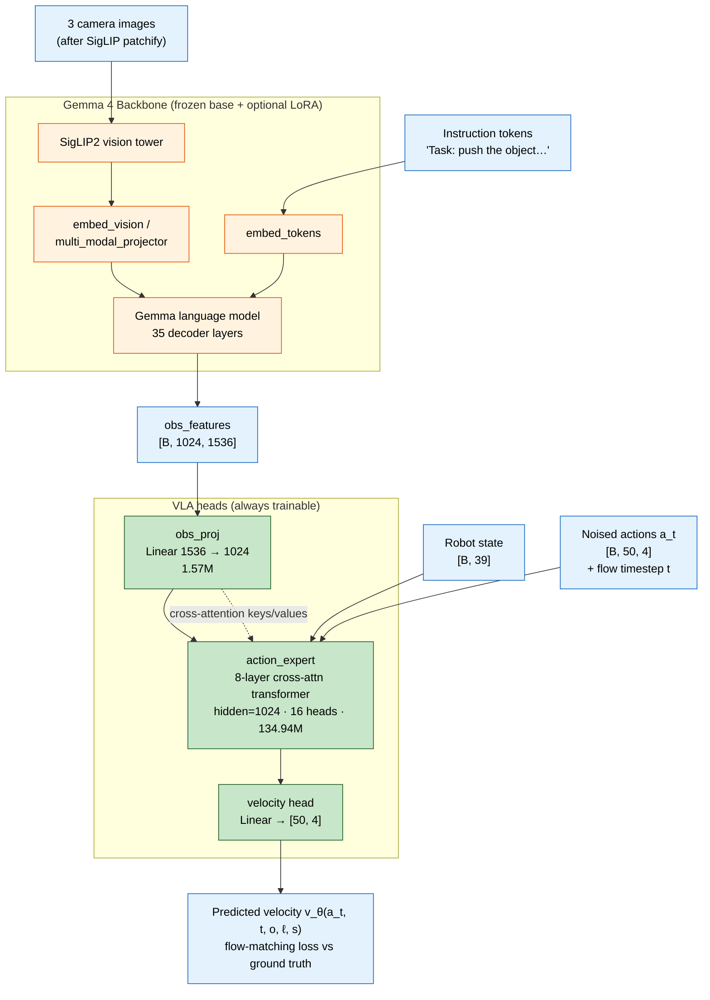
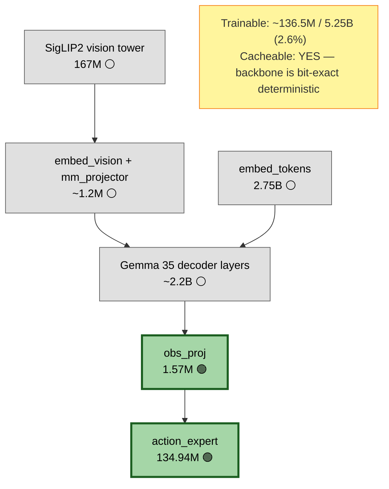
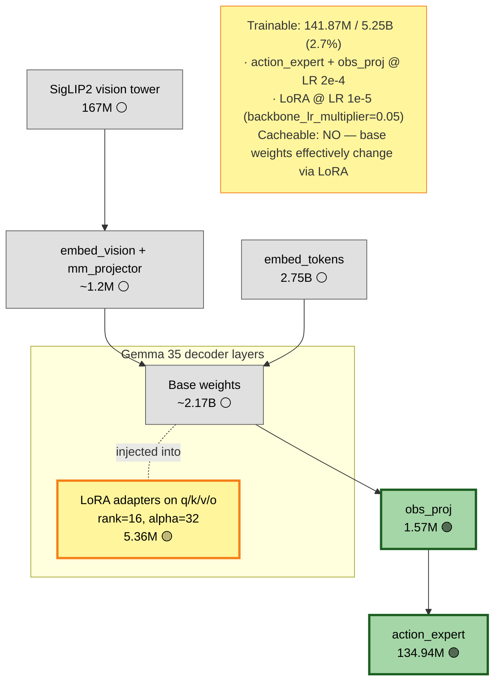
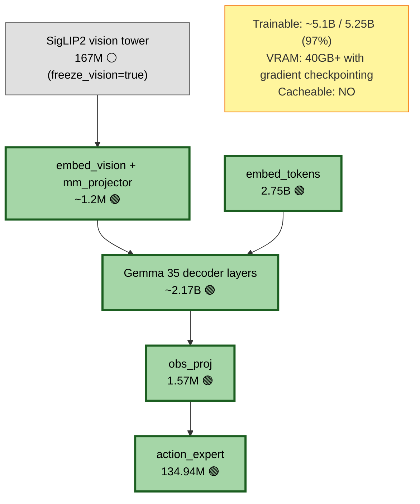

# 11 — Architecture & freeze-map diagrams

Visual reference for the Gemma 4 backbone, the Gemma4VLA model that wraps it,
and which submodules are trainable in each training strategy.

All diagrams use Mermaid and render natively in VSCode's markdown preview,
GitHub, and most modern markdown viewers.

> **Color legend** — applies to every diagram in §3:
> - 🟢 **green** — trainable
> - 🟡 **yellow** — frozen base + trainable LoRA adapters
> - ⚪ **grey** — frozen

---

## 1. Gemma 4 (the base model, as published by Google)

`Gemma4ForConditionalGeneration` from Hugging Face. Specs for the
**E2B-it** variant used in this repo:

| Component | Shape / count |
|---|---|
| Vision tower (SigLIP2) | 16 layers, hidden=768, patch=16 |
| Language model | 35 decoder layers, hidden=1536, 8 attn heads, 1 KV head (MQA), FFN=6144 |
| `embed_tokens` | 2.75 B params (large vocabulary) |
| Total | ~5.1 B params |



**Key point for VLA usage:** `lm_head` and `logits` exist but are **never
used** by Gemma4VLA. We only consume the last-layer hidden states (the
dashed arrow), which is why the language-modeling head can stay frozen
even in full fine-tune.

---

## 2. Gemma4VLA (the wrapped model)

Adds three components on top of Gemma:

| Component | Purpose | Params |
|---|---|---|
| `obs_proj` | Linear projection 1536 → 1024 (Gemma hidden → expert hidden) | 1.57 M |
| `action_expert` | 8-layer transformer with cross-attention to obs_features | 134.94 M |
| Flow-matching velocity head | Final linear inside the expert that outputs the velocity vector | (counted in expert) |



**Information flow:** images + instruction go through the (mostly frozen)
Gemma backbone to produce `obs_features`. The expert then cross-attends
to those features while iteratively denoising a noised action chunk —
that's how the policy generates actions at inference time. The same
forward pass is used for training; the loss is just MSE on the
flow-matching velocity field instead of an autoregressive next-token loss.

---

## 3. Freeze maps per training strategy

The three Gemma4VLA strategies differ only in **what trains** — the
architecture itself is identical. Color-coded:
🟢 trainable · 🟡 LoRA-adapted · ⚪ frozen.

### 3.1 Strategy 1 — Action expert only (Stage 1)

Config: `freeze_backbone: true`, `use_lora: false`. Used for fast Stage-1
warm-up and as the standalone recipe for small datasets.



**Why:** the action expert starts from random init. Its early gradients
are noise. Letting them flow back through the backbone would erode the
pretrained vision/language features for nothing. Freezing the backbone
walls that off. Bonus: with the backbone frozen, its output is
deterministic per sample → `cache_features.py` is valid here and only
here.

---

### 3.2 Strategy 2 — LoRA + Expert (Stage 2)

Config: `freeze_backbone: false`, `use_lora: true`, `freeze_vision: true`.
Adds rank-16 LoRA adapters on `{q,k,v,o}_proj` of all 35 Gemma decoder
layers.



**Why three optimizer settings:**
- Expert + `obs_proj` at full LR — they encode robot-specific information and need to keep moving.
- LoRA at 20× lower LR — surgical adaptation; if LoRA moves too fast, it overwrites Gemma's pretrained capabilities faster than the expert can compensate.
- Everything else frozen — preserves SigLIP2's visual features and Gemma's general reasoning.

**`--init-from` seam:** Stage 2 starts from Stage 1's checkpoint via
`Gemma4VLA.from_pretrained(...)`. LoRA's B matrix initialises to zero, so
**step 0 of Stage 2 produces exactly the same output as the end of
Stage 1**. The loss curve is continuous across the seam.

---

### 3.3 Strategy 3 — Full fine-tune

Config: `freeze_backbone: false`, `use_lora: false`. The `metaworld_push_full.yaml`
recipe. Needs 50k+ demonstrations and an A100 / H100. Not recommended
unless you have data to justify the capacity.



**Why freeze vision even here:** SigLIP2 is much smaller than Gemma
(167M vs 5B) but is the most data-hungry to *re-train* — it requires
diverse image distributions, not robot demonstrations. Most full
fine-tune setups still keep it frozen.

---

## 4. Quick comparison table

| Strategy | Trainable params | LR(s) | Cacheable | Backbone forward per step | Stage in pipeline |
|---|---|---|---|---|---|
| **1. Expert only** | ~136 M (2.6%) | 5e-4 (expert) | ✅ yes | skipped (uses cache) | Stage 1 of two-stage; standalone for small data |
| **2. LoRA + Expert** | ~142 M (2.7%) | 2e-4 (expert), 1e-5 (LoRA) | ❌ no | full | Stage 2 of two-stage |
| **3. Full fine-tune** | ~5.1 B (97%) | 5e-5 (expert), 5e-7 (backbone) | ❌ no | full | When you have 50k+ demos and an A100+ |

For the recommended two-stage pipeline see
[10_multi_camera_two_stage.md](10_multi_camera_two_stage.md).

---

## 5. Rendering these diagrams as standalone images

The Mermaid blocks render inline in any modern markdown viewer. If you
need standalone PNG/SVG (for slides, papers, README headers), use
`mermaid-cli`:

```bash
# One-time install
npm install -g @mermaid-js/mermaid-cli

# Convert every diagram in this file to PNG (one per mermaid block)
mmdc -i docs/11_architecture_diagrams.md -o docs/diagrams/arch.png
```

The output will be written to `docs/diagrams/arch-1.png`,
`arch-2.png`, ... in the order they appear above.
